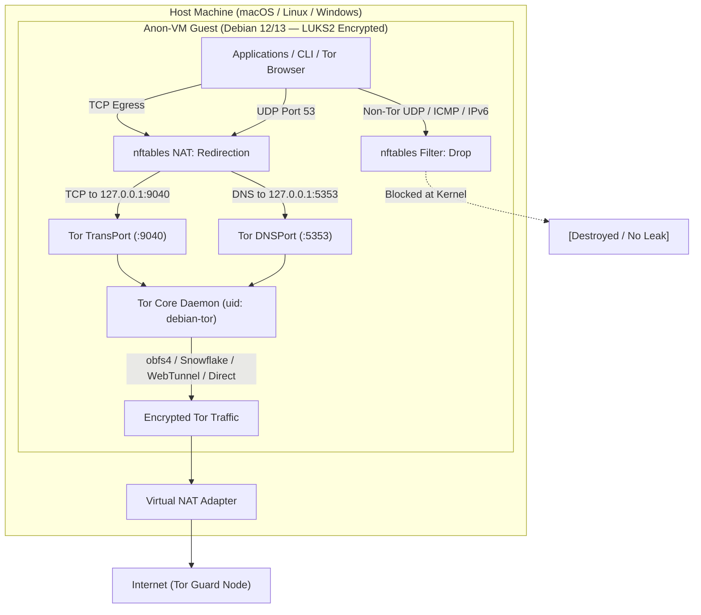
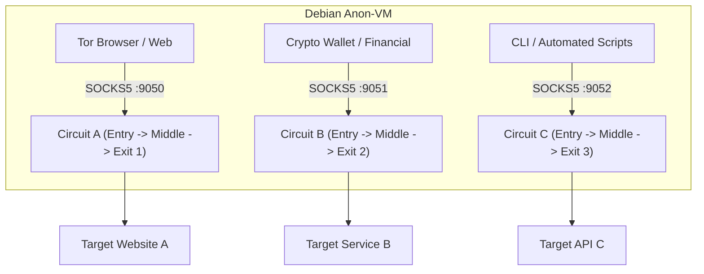

# Debian Anon-VM (`debian-anon-vm`)

[](LICENSE)
[%20%7C%2013%20(Trixie)-red.svg)](https://www.debian.org/)
[](https://www.torproject.org/)
[](docs/ARCHITECTURE.md)
[](CONTRIBUTING.md)

Transform a clean **Debian GNU/Linux 12 (Bookworm) or 13 (Trixie)** installation into an **isolated, hardened, fail-closed anonymous operating system** running inside a virtual machine (UTM, VirtualBox, KVM).

---

## Key Capabilities

* **Universal Transparent Proxy (Fail-Closed):** All outbound IPv4 TCP and DNS traffic is strictly captured and routed through the Tor network. If the Tor daemon crashes or stops, the firewall acts as a kill-switch, blocking 100% of clearnet traffic.
* **Zero-Leak Policy:** Non-Tor protocols (UDP, ICMP) and IPv6 are dropped at the kernel level (`policy drop` in `nftables` and `sysctl disable_ipv6`).
* **Kernel & Memory Hardening:**
  * Process isolation via Yama LSM (`kernel.yama.ptrace_scope = 2`).
  * TTY command injection mitigation (`dev.tty.legacy_tiocsti = 0`).
  * Kernel memory zeroing on allocation/free (`init_on_alloc=1`, `init_on_free=1` in GRUB).
  * Core dumps disabled (`limits.conf` and `systemd-coredump`).
  * Restrictive user permissions (`umask 027`, `/home/*` locked to `700`, `TMOUT=900` auto-logout).
  * Secure temporary mounts (`noexec,nosuid,nodev` on `/tmp` and `/dev/shm`).
  * Process table hiding (`hidepid=2,gid=sudo` on `/proc`).
  * Mandatory Access Control with AppArmor in enforce mode.
  * Attack surface reduction: Blacklist of unused protocols (`dccp`, `sctp`, `rds`, `tipc`) and legacy filesystems (`cramfs`, `jffs2`, `hfs`, `udf`).
* **Anti-Fingerprinting:** UTC timezone enforcement, automated MAC address randomization at boot (`macchanger`), neutral hostname (`localhost`), noisy service deactivation (`avahi`, `cups`, `bluetooth`, `ModemManager`), and anonymous HTTPS time synchronization via Tor (`htpdate`).
* **Stream Isolation:** Dedicated isolated SOCKS5 ports (9050, 9051, 9052) with `IsolateDestAddr` and `IsolateDestPort` to prevent traffic correlation across applications.
* **Pluggable Transports:** Support for `obfs4`, `Snowflake`, and `WebTunnel` bridges for environments with DPI or ISP-level Tor blocking.

---

## System Architecture



---

## Prerequisites

1. **Operating System:** Clean minimal installation of **Debian GNU/Linux 12 (Bookworm)** or **Debian 13 (Trixie)**.
2. **Architecture:** `ARM64` (Apple Silicon UTM) or `x86_64` (VirtualBox / KVM / Proxmox).
3. **Storage Encryption (Mandatory):** Install Debian using **Full Disk Encryption (LUKS2 / LVM)** during the guided installer partitioning step.

---

## Quickstart

```bash
# 1. Clone the repository
git clone https://github.com/aleaz/debian-anon-vm.git
cd debian-anon-vm

# 2. Run full automated pipeline (Setup + Hardening + Security Audit)
sudo ./anon-vm all

# 3. (Optional: Use obfs4 bridges file)
sudo ./anon-vm all --bridges-file /path/to/my-bridges.txt

# 4. Reboot to apply all kernel sysctl, GRUB memory sanitization and mount options
sudo reboot
```

---

## CLI Command Reference (`anon-vm`)

The `anon-vm` toolkit provides a unified, modular, and idempotent interface:

```bash
# Setup Tor transparent proxy, nftables firewall, and DNS routing
sudo ./anon-vm setup [--bridges-file FILE | --no-bridges] [--iface IFACE]

# Apply comprehensive OS, Kernel (Yama, GRUB, sysctl), user & filesystem hardening
sudo ./anon-vm harden [--iface IFACE] [--dry-run]

# Run the 12-section security, leak detection, and hardening audit suite
sudo ./anon-vm check

# Show current Tor connection health, circuits, and public exit IP
./anon-vm status

# Rollback configuration to a previous snapshot
sudo ./anon-vm rollback

# Uninstall Anon-VM and restore standard clearnet networking
sudo ./anon-vm uninstall
```

---

## Stream Isolation & Application Usage

Tor stream isolation creates independent circuits for distinct applications to prevent cross-service identity correlation:



| SOCKS5 Port | Isolation Policy | Recommended Use Case |
| :--- | :--- | :--- |
| **`127.0.0.1:9050`** | `IsolateDestAddr`, `IsolateDestPort` | Standard browsing, general tools, package updates |
| **`127.0.0.1:9051`** | `IsolateDestAddr` | Financial apps, cryptocurrency wallets (Monero / Feather) |
| **`127.0.0.1:9052`** | `IsolateDestAddr`, `IsolateDestPort`, `IsolateClientAddr` | Sensitive CLI automation, scraping, isolated sessions |

### CLI Example

```bash
# Query endpoint A via isolated circuit
curl --socks5-hostname 127.0.0.1:9051 https://api-a.com

# Query endpoint B via completely different circuit and exit IP
curl --socks5-hostname 127.0.0.1:9052 https://api-b.com
```

---

## Threat Boundaries & Comparison

| Security Vector | Tails OS (Live USB) | Whonix (2 VMs) | Debian Anon-VM (This Project) |
| :--- | :--- | :--- | :--- |
| **Storage Security** | Encrypted Persistent Volume | Optional | **LUKS2 Full Disk Encryption** |
| **Tor Routing** | iptables/nftables | Hypervisor Gateway | **Fail-Closed nftables** |
| **Kill-Switch** | Yes | Yes | **Yes (nftables drop policy)** |
| **DNS / UDP Leaks** | Blocked | Blocked | **Blocked (Dropped at kernel level)** |
| **Stream Isolation** | Per application | Per SocksPort | **Multi-Socks + IsolateDestAddr** |
| **Amnesia (RAM-Only)** | Total (Live mode) | Optional | **Hypervisor Snapshots** |
| **Root Compromise** | Partial | **Total** (Gateway isolated) | **Limited** (Root sees interface) |

For in-depth threat modeling and test cases, see [docs/THREAT_MODEL.md](docs/THREAT_MODEL.md) and [docs/ARCHITECTURE.md](docs/ARCHITECTURE.md).

---

## Documentation

* [Software Design Document & Architecture](docs/ARCHITECTURE.md)
* [Threat Model & Acceptance Test Matrix](docs/THREAT_MODEL.md)
* [Hypervisor Configuration Guide (UTM, VirtualBox, KVM)](docs/HYPERVISORS.md)
* [Security Policy & Vulnerability Disclosure](SECURITY.md)
* [Contributing Guidelines](CONTRIBUTING.md)

---

## License

This project is licensed under the **GNU General Public License v3.0 (GPL-3.0)**. See the [LICENSE](LICENSE) file for details.
