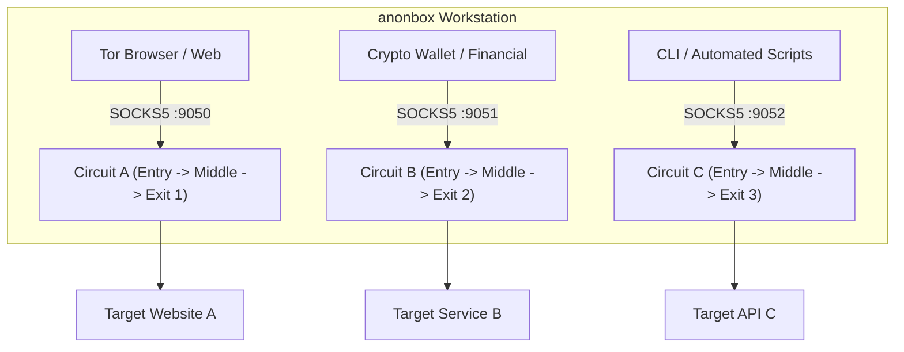

<div align="center">

# 🧅 Anonbox

## *Turn any Debian VM into an isolated, fail-closed, hardened Tor workstation.*

[](https://github.com/aleaz/anonbox/releases)
[%20%7C%2013%20(Trixie)-D70A53.svg?style=flat-square&logo=debian&logoColor=white)](https://www.debian.org/)
[](https://www.torproject.org/)
[](docs/ARCHITECTURE.md)
[](https://github.com/aleaz/anonbox/actions/workflows/lint.yml)
[](LICENSE)

<p align="center">
  🛡️ <b>Fail-Closed nftables</b> &nbsp;•&nbsp; 🔒 <b>KSPP & Yama LSM</b> &nbsp;•&nbsp; 🚫 <b>Zero DNS/IPv6 Leaks</b> &nbsp;•&nbsp; 🔀 <b>Stream Isolation</b>
</p>

</div>

---

## At a Glance

| Specification | Details |
| :--- | :--- |
| **Target OS** | Debian GNU/Linux 12 (Bookworm) and 13 (Trixie) |
| **Architecture** | `ARM64` (Apple Silicon UTM) and `x86_64` (VirtualBox, KVM, Proxmox) |
| **Traffic Policy** | 100% Fail-Closed routing through Tor (`nftables` priority drop) |
| **Security Standards** | KSPP (Kernel Self Protection), Tails OS & Whonix Hardening Patterns |
| **Storage Security** | Verified LUKS2 Full-Disk Encryption & eCryptfs Persistent Volumes |

## Quickstart

Get a hardened anonymous workstation running in under 2 minutes:

```bash
# 1. Clone the repository inside your clean Debian VM
git clone https://github.com/aleaz/anonbox.git
cd anonbox

# 2. Run the automated pipeline (Setup -> Hardening -> 12-Point Security Audit)
sudo ./anonbox all

# Optional: Connect via obfs4 anti-censorship bridges
# sudo ./anonbox all --bridges-file /path/to/bridges.txt

# 3. Reboot to apply kernel sysctl, GRUB memory sanitization, and mount restrictions
sudo reboot
```

> [!IMPORTANT]
> **Prerequisites:** Clean minimal installation of **Debian 12 or 13** with **LUKS Full-Disk Encryption** enabled during guided partitioning.

## Why Anonbox?

| Security Vector | Tails OS (Live USB) | Whonix (2 VMs: Gateway + WS) | Anonbox (This Project) |
| :--- | :--- | :--- | :--- |
| **Deployment Model** | Ephemeral Live USB | 2 Dedicated VMs (Heavy RAM) | **Single Hardened VM (Lightweight)** |
| **Persistence** | Limited to USB Volume | VM Disk Images | **LUKS2 / eCryptfs Encrypted Persistence** |
| **Tor Routing** | iptables/nftables | Hypervisor-isolated Gateway | **Local Fail-Closed nftables Kill-Switch** |
| **Leak Prevention** | Blocked | Blocked | **Kernel-Level Drop (UDP, ICMP, IPv6)** |
| **Stream Isolation** | Per application | Per SocksPort | **Multi-Port Isolation (9050, 9051, 9052)** |
| **Anti-Fingerprint** | UTC, MAC, Hostname | Standardized Identity | **UTC, Auto-MAC, Standardized Machine-ID** |

## System Architecture


## Core Security Pillars

* 🌐 **100% Fail-Closed Transparent Routing:** All outbound TCP and DNS traffic is redirected to Tor (`TransPort 9040` / `DNSPort 5353`). If the Tor daemon terminates, the firewall blocks 100% of clearnet traffic. Non-Tor UDP, ICMP, and IPv6 packets are dropped at kernel level.
* 🛡️ **Kernel & Memory Protection:** Memory zeroing on allocation/free (`init_on_alloc=1`, `init_on_free=1` in GRUB), Yama LSM ptrace restriction (`ptrace_scope=2`), TTY command injection mitigation (`legacy_tiocsti=0`), core dumps disabled, and secure `noexec,nosuid,nodev` mounts for `/tmp`, `/var/tmp`, and `/dev/shm`.
* 🎭 **Anti-Fingerprinting & Telemetry Suppression:** Forced UTC timezone, MAC address randomization at boot (`macchanger` & NetworkManager), neutral hostname (`localhost`), standardized `/etc/machine-id` pool UUID, and Debian `popularity-contest` purging.
* 🔀 **Stream Isolation & Anti-Censorship:** Multi-SOCKS5 circuit isolation (9050, 9051, 9052) preventing traffic correlation across applications, paired with native support for `obfs4`, `Snowflake`, and `WebTunnel` pluggable transports.

## CLI Command Reference (`anonbox`)

The `anonbox` toolkit provides a unified, idempotent CLI interface:

```bash
# Setup Tor transparent proxy, nftables firewall, and DNS routing
sudo ./anonbox setup [--bridges-file FILE | --no-bridges] [--iface IFACE]

# Apply comprehensive OS, Kernel (Yama, GRUB, sysctl), user & filesystem hardening
sudo ./anonbox harden [--iface IFACE] [--dry-run]

# Run the 12-section security, leak detection, and hardening audit suite
sudo ./anonbox check

# Show current Tor connection health, circuits, and public exit IP
./anonbox status

# Rollback configuration to a previous snapshot
sudo ./anonbox rollback

# Uninstall anonbox and restore standard clearnet networking
sudo ./anonbox uninstall
```

## Stream Isolation & Application Routing

Tor stream isolation ensures independent circuits for distinct application classes:



| SOCKS5 Port | Isolation Policy | Recommended Use Case |
| :--- | :--- | :--- |
| **`127.0.0.1:9050`** | `IsolateDestAddr`, `IsolateDestPort` | Standard browsing, general tools, package updates |
| **`127.0.0.1:9051`** | `IsolateDestAddr` | Financial apps, cryptocurrency wallets (Monero / Feather) |
| **`127.0.0.1:9052`** | `IsolateDestAddr`, `IsolateDestPort`, `IsolateClientAddr` | Sensitive CLI automation, scraping, isolated sessions |

```bash
# Query endpoint A via isolated circuit
curl --socks5-hostname 127.0.0.1:9051 https://api-a.com

# Query endpoint B via completely different circuit and exit IP
curl --socks5-hostname 127.0.0.1:9052 https://api-b.com
```

## Documentation

* [Software Design Document & Architecture](docs/ARCHITECTURE.md)
* [Threat Model & Acceptance Test Matrix](docs/THREAT_MODEL.md)
* [Hypervisor Configuration Guide (UTM, VirtualBox, KVM)](docs/HYPERVISORS.md)
* [Security Policy & Vulnerability Disclosure](SECURITY.md)
* [Contributing Guidelines](CONTRIBUTING.md)
* [Changelog](CHANGELOG.md)

---

## License

This project is licensed under the **GNU General Public License v3.0 (GPL-3.0)**. See the [LICENSE](LICENSE) file for details.
