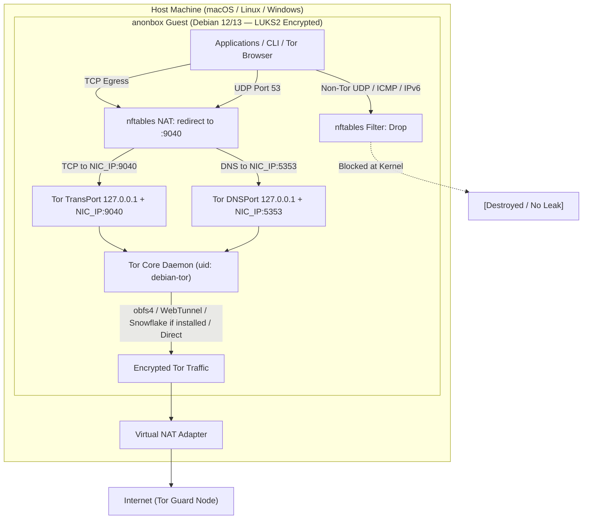
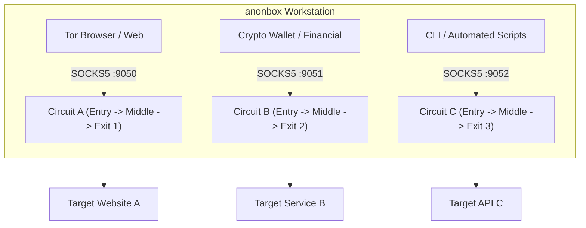

<div align="center">

# 🧅 Anonbox

## *A small toolkit that quickly turns a standard Debian guest VM into a fail-closed Tor workstation.*

[](https://github.com/aleaz/anonbox/releases)
[%20%7C%2013%20(Trixie)-D70A53.svg?style=flat-square&logo=debian&logoColor=white)](https://www.debian.org/)
[](https://www.torproject.org/)
[](docs/ARCHITECTURE.md)
[](https://github.com/aleaz/anonbox/actions/workflows/lint.yml)
[](LICENSE)

<p align="center">
  <b>Fail-Closed nftables</b> &nbsp;•&nbsp; <b>KSPP & Yama LSM</b> &nbsp;•&nbsp; <b>Zero DNS/IPv6 Leaks</b> &nbsp;•&nbsp; <b>Stream Isolation</b>
</p>

</div>

---

## At a Glance

| Specification | Details |
| :--- | :--- |
| **Target OS** | Debian GNU/Linux 12 (Bookworm) and 13 (Trixie) |
| **Architecture** | `ARM64` (Apple Silicon UTM) and `x86_64` (VirtualBox, KVM, Proxmox) |
| **Traffic Policy** | 100% Fail-Closed routing through Tor (`nftables` priority drop) |
| **Security Standards** | KSPP (Kernel Self Protection), Tails OS & Whonix Hardening Patterns |
| **Storage Security** | User-provided LUKS2 / eCryptfs; **required for SAFE**, optional for disposable lab |
| **Deployment** | Dedicated Debian **guest VM** only (not your daily host / bare metal) |

> [!WARNING]
> **Dedicated VM only.** Run `anonbox` inside a guest (UTM / VirtualBox / KVM). **Do not** run it on your daily host or trusted bare metal: hardening closes inbound access by default, can lock you out, and a compromised host defeats the guest (see [SECURITY.md](SECURITY.md) and [docs/THREAT_MODEL.md](docs/THREAT_MODEL.md)).

---

> [!IMPORTANT]
> **What this is:** a small Debian toolkit (one main script + docs) that quickly provisions a fail-closed Tor workstation on a **standard Debian 12/13 VM**. It is **not** Tails, Whonix, an amnesic Live OS, or a new anonymous operating system. Persistence is intentional; discard sessions via [hypervisor snapshots](docs/HYPERVISORS.md).
>
> **Disk encryption:** you enable LUKS/eCryptfs at Debian install time — anonbox does **not** set it up. The script **runs without** encryption. Keep data on the VM → encryption **recommended**. Throwaway / revert-snapshot → optional. `anonbox check` reports **SAFE** only with encryption present.
>
> **SSH:** closed by default (use the hypervisor console). Lab only: `sudo ./anonbox all --allow-ssh` (RFC1918 inbound). Prefer NAT / host-only, not an open bridged LAN.
>
> **Prerequisites:** Clean minimal **Debian 12 or 13** guest. Interactive browsing needs **Tor Browser** (`torbrowser-launcher` when packaged). Transparent proxy does not replace browser anti-fingerprint.

## Quickstart

Run this **only inside a dedicated Debian VM**. Provision a fail-closed Tor workstation in under 2 minutes:

```bash
# 1. Clone inside your clean Debian guest VM (not the host OS)
# NOTE: this step and the first apt install run over CLEARNET (ISP sees packages).
# Prefer a preseeded/offline image when that residual matters (see docs/THREAT_MODEL.md).
git clone https://github.com/aleaz/anonbox.git
cd anonbox

# 2. Run the automated pipeline (Setup -> Hardening -> Security Audit)
sudo ./anonbox all

# Optional: Connect via obfs4 anti-censorship bridges
# sudo ./anonbox all --bridges-file /path/to/bridges.txt

# Lab over SSH (keeps RFC1918 SSH): sudo ./anonbox all --allow-ssh

# 3. Reboot to apply kernel sysctl, GRUB memory sanitization, and mount restrictions
sudo reboot
```

## Why Anonbox?

| Security Vector | Tails OS (Live USB) | Whonix (2 VMs: Gateway + WS) | Anonbox (This Project) |
| :--- | :--- | :--- | :--- |
| **Deployment Model** | Ephemeral Live USB | 2 Dedicated VMs (Heavy RAM) | **Single hardened guest VM (toolkit / script)** |
| **Persistence** | Limited to USB Volume | VM Disk Images | **Persistent by design** (encrypt if you enable LUKS; **not** amnesia) |
| **Tor Routing** | iptables/nftables | Hypervisor-isolated Gateway | **Local Fail-Closed nftables Kill-Switch** |
| **Leak Prevention** | Blocked | Blocked | **Kernel-Level Drop (UDP, ICMP, IPv6)** |
| **Stream Isolation** | Per application | Per SocksPort | **Multi-Port Isolation (9050, 9051, 9052)** |
| **Anti-Fingerprint** | UTC, MAC, Hostname | Standardized Identity | **UTC, hostname, machine-id; NM MAC (not L2 under NAT)** |

## System Architecture



## Core Security Pillars

* **100% Fail-Closed Transparent Routing:** All outbound TCP and DNS traffic is nft-`redirect`ed to Tor (`TransPort`/`DNSPort` on `127.0.0.1` and the NIC primary IP — never `0.0.0.0`). INPUT drops new LAN connections to those ports. If Tor terminates, the firewall drops non-Tor egress. Non-Tor UDP, ICMP, and IPv6 are dropped at kernel level.
* **Kernel & Memory Protection:** Memory zeroing on allocation/free (`init_on_alloc=1`, `init_on_free=1` in GRUB), Yama LSM ptrace restriction (`ptrace_scope=2`), TTY command injection mitigation (`legacy_tiocsti=0`), core dumps disabled, and secure `noexec,nosuid,nodev` mounts for `/tmp`, `/var/tmp`, and `/dev/shm`. Unprivileged user namespaces stay enabled so Tor Browser's sandbox works.
* **Identity & Telemetry Suppression:** Forced UTC, NetworkManager cloned-MAC (guest NIC only — **not** L2 anti-FP under hypervisor NAT), neutral hostname (`localhost`), standardized `/etc/machine-id`, and Debian `popularity-contest` purging. Shell `HISTFILE` is unset (not Tails-style amnesia).
* **Stream Isolation & Anti-Censorship:** Multi-SOCKS5 circuit isolation (9050, 9051, 9052). `obfs4` and `WebTunnel` via obfs4proxy/lyrebird; Snowflake only if `snowflake-client` is installed.

> Interactive browsing must use **Tor Browser**. The transparent proxy does not hide canvas, WebGL, or font fingerprints of a stock browser.

## CLI Command Reference (`anonbox`)

The `anonbox` toolkit provides a unified, idempotent CLI interface:

```bash
# Full automated deployment (Setup -> Harden -> Audit)
sudo ./anonbox all [--bridges-file FILE] [--verbose] [--yes]

# Setup Tor transparent proxy, nftables firewall, and DNS routing
sudo ./anonbox setup [--bridges-file FILE | --no-bridges] [--iface IFACE] [--verbose]

# Apply comprehensive OS, Kernel (Yama, GRUB, sysctl), user & filesystem hardening
sudo ./anonbox harden [--iface IFACE] [--dry-run] [--verbose]

# Run the leak-detection and hardening audit (includes kill-switch)
sudo ./anonbox check
# Frequent triage without stopping Tor (not a release gate):
sudo ./anonbox check --no-kill-switch
# Machine-readable (stdout = one JSON object; human logs on stderr):
sudo ./anonbox check --json --quiet

# Quiet human audit: FAIL/WARN + result card only
sudo ./anonbox check --quiet

# Read-only diagnostics with Fix hints (no kill-switch)
sudo ./anonbox doctor

# Show current Tor connection health, circuits, and public exit IP
./anonbox status

# Rollback configuration to a chosen snapshot (ID: YYYYMMDD_HHMMSS[_PID])
sudo ./anonbox rollback --snapshot 20260824_120000 --yes

# Uninstall anonbox (baseline nftables accept policy; not an empty flush)
sudo ./anonbox uninstall --yes
```

**Exit codes** (`check` / `doctor` / `all`): `0` SAFE, `1` leak/network/Tor failure, `2` hardening/storage only.

**Output:** humans on **stderr** (progress, FAIL/WARN, result card). `--json` prints one object on **stdout** (do not parse human tables). `--silent` is an alias of `--quiet`. Colors follow stderr TTY, `NO_COLOR`, `TERM=dumb`, `FORCE_COLOR`, and `--color=auto|always|never`.

**Session log:** basename only under `/var/log/anonbox/` (`--log-file NAME`). Absolute paths rejected.

**Bash completion:** `source completions/anonbox.bash` (zsh: `autoload bashcompinit; bashcompinit` then source).

Per-command help: `./anonbox check --help`.

## Stream Isolation & Application Routing

Tor stream isolation ensures independent circuits for distinct application classes:



| SOCKS5 Port | Isolation Policy | Recommended Use Case |
| :--- | :--- | :--- |
| **`127.0.0.1:9050`** | `IsolateDestAddr`, `IsolateDestPort` | Standard browsing, general tools, package updates |
| **`127.0.0.1:9051`** | `IsolateDestAddr` | Financial apps, cryptocurrency wallets (Monero / Feather) |
| **`127.0.0.1:9052`** | `IsolateDestAddr`, `IsolateDestPort`, `IsolateClientAddr` | Sensitive CLI automation, scraping, isolated sessions |

```bash
# Query endpoint A via isolated circuit
curl --socks5-hostname 127.0.0.1:9051 https://api-a.com

# Query endpoint B via completely different circuit and exit IP
curl --socks5-hostname 127.0.0.1:9052 https://api-b.com
```

## Anti-Censorship Bridges (Pluggable Transports)

If connecting from behind state-level DPI firewalls or censored networks, `anonbox` configures `obfs4` and `WebTunnel` via `obfs4proxy` or `lyrebird`. Snowflake is added only when `/usr/bin/snowflake-client` is present.

### 1. Acquiring Official Bridges

Obtain private bridge lines from official Tor Project distribution channels:

* **Web:** [https://bridges.torproject.org/options](https://bridges.torproject.org/options) (select `obfs4`)
* **Email:** Send an email to `bridges@torproject.org` from a Gmail or Riseup account with body `get transport obfs4`
* **Telegram:** Chat with [@GetBridgesBot](https://t.me/GetBridgesBot) and send `/bridges`
* **Tor Browser:** Copy bridges from *Settings > Tor > Bridges*

### 2. Bridge File Format

Create a `bridges.txt` file (or copy from [`bridges.txt.example`](bridges.txt.example)). Each active line **must** start with the `Bridge` keyword:

```text
# Example obfs4 bridges (one per line)
Bridge obfs4 192.0.2.1:443 752FC927DA740424818FF29F47E1B0678F4638D7 cert=kHn8vQ+u6q49m9k/855iL0ZcK4hQzV6c7kF+2B280B23... iat-mode=0
Bridge obfs4 198.51.100.25:9001 9B4F81A54E1803762804561234567890ABCDEF12 cert=abc123xyz... iat-mode=0
```

> [!TIP]
> Comments (`#`) and empty lines are ignored automatically. `anonbox` runs `tor --verify-config`, then starts Tor and **aborts** unless listeners are safe (no `0.0.0.0`; SOCKS/Control on localhost; TransPort/DNSPort on localhost + NIC IP) and bootstrap reaches 100%.

### 3. Deploying with Bridges

```bash
# 1. Copy the example template
cp bridges.txt.example bridges.txt

# 2. Paste your acquired bridges into bridges.txt
nano bridges.txt

# 3. Run anonbox with the bridge file
sudo ./anonbox all --bridges-file bridges.txt
```

## Documentation

* [Software Design Document & Architecture](docs/ARCHITECTURE.md)
* [Threat Model & Acceptance Test Matrix](docs/THREAT_MODEL.md)
* [Hypervisor Configuration Guide (UTM, VirtualBox, KVM)](docs/HYPERVISORS.md)
* [Security Policy & Vulnerability Disclosure](SECURITY.md)
* [Contributing Guidelines](CONTRIBUTING.md)
* [Changelog](CHANGELOG.md)

---

## License

This project is licensed under the **GNU General Public License v3.0 (GPL-3.0)**. See the [LICENSE](LICENSE) file for details.
