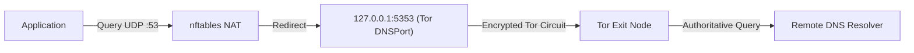
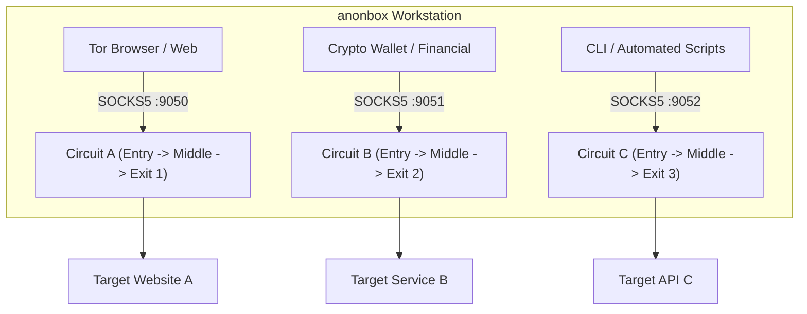

# Software Design Document & System Architecture

## Self-Hosted Anonymous Operating System in a Virtual Machine (`anonbox`)

* **Document:** `docs/ARCHITECTURE.md`
* **Target Operating System:** Debian GNU/Linux 12 (Bookworm) and 13 (Trixie) [ARM64 / x86_64]
* **Target Hypervisors:** UTM (Apple Silicon / macOS), VirtualBox, KVM / QEMU
* **Status:** Stable / Production-Ready

---

## 1. System Overview & Philosophy

The objective of `anonbox` is to transform a standard minimal installation of Debian GNU/Linux (12 or 13) into an isolated, hardened, fail-closed anonymous virtual workstation. All non-local network traffic (TCP and DNS) is strictly routed through the Tor network, while non-Tor egress (IPv6, raw UDP, ICMP) is destroyed at the kernel level.

### 1.1. Core Architectural Flow

---

## 2. Network & Packet Filter Architecture (`nftables`)

### 2.1. Fail-Closed Firewall: Why `nftables` over `iptables`

* **Atomic Ruleset Replacement:** `nftables` updates its ruleset atomically in a single kernel transaction (`nft -f`). Unlike legacy `iptables`, there is no window where partial rules are active during firewall reloads.
* **Unified Family Handling:** A single `table ip` and `table ip6` syntax manages both IPv4 redirection and total IPv6 blockage cleanly.
* **Native Socket Matching:** `skuid debian-tor` matching allows the Tor daemon itself to send packets to the physical network while redirecting or dropping all other user and system processes.

### 2.2. Robust DNS Leak Prevention & Precedence

* **Loopback Interception Precedence:** In `table ip tor_nat`, DNS redirection (`udp dport 53 redirect to :5353` and `tcp dport 53 redirect to :5353`) is evaluated at the **absolute top** of `chain output` before any `oifname "lo" return`. This guarantees that local loopback queries directed to `127.0.0.1:53` or `127.0.1.1` are intercepted without escaping.
* **NetworkManager DNS Management:** NetworkManager is instructed to relinquish DNS management via `/etc/NetworkManager/conf.d/no-dns.conf` (`dns=none`), `systemd-resolved` is masked and removed, and `/etc/resolv.conf` is statically fixed to `127.0.0.1`.

### 2.3. Boot Race Condition Protection

To eliminate the microsecond packet leak window where network interfaces come up before firewall rules load, `anonbox` deploys a systemd drop-in override at `/etc/systemd/system/nftables.service.d/override.conf`:

* `Before=network-pre.target shutdown.target`
* `Wants=network-pre.target`
* `DefaultDependencies=no`

### 2.4. LAN Egress Restriction & Inbound SSH

* **Zero Outbound RFC 1918 Leak:** Blanket outbound egress to `10.0.0.0/8`, `172.16.0.0/12`, `192.168.0.0/16` is blocked.
* **Stateful Admin SSH:** Inbound administrative SSH connections on port 22 are permitted from private LAN subnets in `chain input`, and replies are handled strictly via stateful matching (`ct state established,related accept`) in `chain output`.
* **DHCP Renewal Exemption:** Outbound DHCP lease renewal queries (`udp sport 68 udp dport 67 accept`) are explicitly allowed on the virtual adapter.

### 2.5. Stream Isolation Architecture

Rather than pooling all application traffic through a single Tor circuit, `anonbox` provides multiple isolated SOCKS ports in `/etc/tor/torrc`:

* **Port 9040 (TransPort):** Transparent proxy with `IsolateDestAddr` and `IsolateDestPort`.
* **Port 9050 (SOCKS):** Default proxy with `IsolateDestAddr` and `IsolateDestPort`.
* **Port 9051 (SOCKS):** Dedicated for cryptocurrency wallets or financial apps with `IsolateDestAddr`.
* **Port 9052 (SOCKS):** Maximum isolation with `IsolateDestAddr`, `IsolateDestPort`, and `IsolateClientAddr`.

---

## 3. Kernel, Memory & System Hardening (KSPP & Tails Standards)

### 3.1. Kernel Self-Protection (KSPP) & Sysctl Stack

* **`kernel.yama.ptrace_scope = 2`:** Prevents an unprivileged process from attaching to or injecting code into other processes owned by the same user (such as inspecting browser memory).
* **`dev.tty.legacy_tiocsti = 0`:** Closes a classic sandbox escape vector where child processes inject keystrokes into the controlling TTY.
* **`kernel.randomize_va_space = 2`:** Enforces full Address Space Layout Randomization (ASLR) for stack, VDSO, heap, and mmap allocations.
* **`kernel.kexec_load_disabled = 1`:** Prevents runtime replacement of the running Linux kernel via kexec.
* **`kernel.unprivileged_userns_clone = 0`:** Closes unprivileged user namespace creation, mitigating ~30% of local privilege escalation exploits.
* **`net.ipv4.tcp_timestamps = 0`:** Disables TCP timestamps to prevent microsecond clock-skew de-anonymization and machine correlation across circuits.
* **`init_on_alloc=1` & `init_on_free=1` (GRUB):** Fills memory pages with zeros upon allocation and deallocation, mitigating Use-After-Free vulnerabilities and residual memory forensics.
* **`fs.suid_dumpable = 0` & `systemd-coredump` disabled:** Prevents sensitive memory contents (keys, tokens) from being dumped to disk during application crashes.

### 3.2. User Session Hardening

* **`UMASK 027` & `chmod 700 /home/*`:** Files created by users are unreadable by other local accounts or unprivileged services.
* **`TMOUT=900`:** Automatically logs out idle shell sessions after 15 minutes.
* **`sudo use_pty`:** Prevents sudo commands from capturing and manipulating user terminal buffers.
* **`pam_wheel.so use_uid`:** Restricts the `su` command to members of the `sudo` group.

### 3.3. Mount Hardening & Attack Surface Reduction

* **`noexec,nosuid,nodev` on `/tmp`, `/var/tmp`, and `/dev/shm`:** Prevents execution of malicious payloads from temporary world-writable directories.
* **`hidepid=2,gid=sudo` on `/proc`:** Prevents unprivileged users from viewing processes owned by other users (including the Tor daemon and system daemons).
* **Extended Module Blacklist:** Disables vulnerable and legacy subsystems: `bluetooth`, `btusb`, `vivid`, `dccp`, `sctp`, `rds`, `tipc`, `cramfs`, `freevxfs`, `jffs2`, `hfs`, `hfsplus`, `udf`, `firewire-core`, `thunderbolt`, `n-hdlc`, `ax25`, `netrom`, `x25`, `rose`, `decnet`.
* **Mandatory Access Control:** AppArmor in full enforce mode (`aa-enforce`).

---

## 4. Anti-Fingerprinting & Telemetry Suppression

### 4.1. System Identity Camouflage (`machine-id`)

* **Standardized Anonymity Pool:** `/etc/machine-id` and `/var/lib/dbus/machine-id` are fixed to a uniform UUID (`b080b36e271609e5dd34d2b90ef76453`), preventing local applications from generating persistent cross-session tracking tokens.

### 4.2. Network & DHCP Privacy

* **Native NetworkManager MAC Randomization:** `cloned-mac-address=random` in `/etc/NetworkManager/conf.d/00-mac-randomize.conf` ensures MAC address rotation occurs before the first DHCP packet is emitted.
* **Suppression of DHCP Hostname (Option 12):** `ethernet.dhcp-send-hostname=false` stops the VM from revealing its hostname to the local router or hypervisor.
* **Deactivation of Connectivity Checks:** NetworkManager connectivity checking (`http://network-test.debian.org/nm`) is disabled via `[connectivity] enabled=false`.

### 4.3. Telemetry Removal & Anonymous Time Sync

* **Popularity Contest Purged:** `popularity-contest` is uninstalled during setup.
* **Masked Services:** `geoclue.service` (geolocation), `kerneloops.service`, `whoopsie.service`, `avahi-daemon`, and `cups` are masked.
* **Deterministic `htpdate` over Tor:** Time synchronization occurs securely via Tor SOCKS5 using `htpdate`, polling until port 9050 is available.
* **UTC Timezone & Neutral Hostname:** `timedatectl set-timezone UTC` and `hostnamectl set-hostname localhost`.

---

## 5. Mandatory Pre-requisite: LUKS Full-Disk Encryption

> [!IMPORTANT]
> Because `anonbox` is designed as a persistent virtual workstation rather than a RAM-only Live ISO (like Tails), **Full-Disk Encryption (LUKS2)** is mandatory during Debian installation. This ensures that when the VM is powered off, no unencrypted browsing history, private keys, or swap pages remain accessible on the host filesystem.
