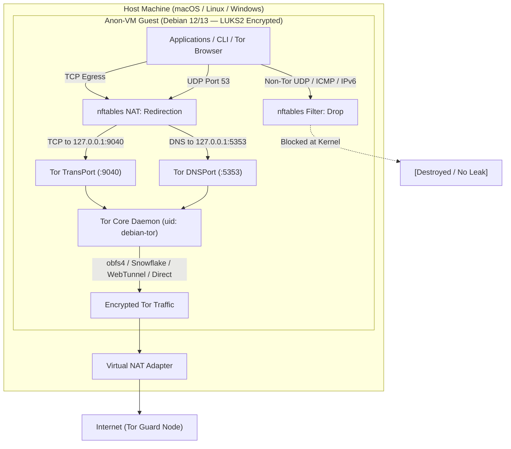
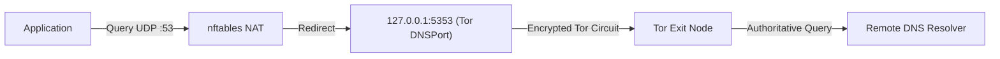
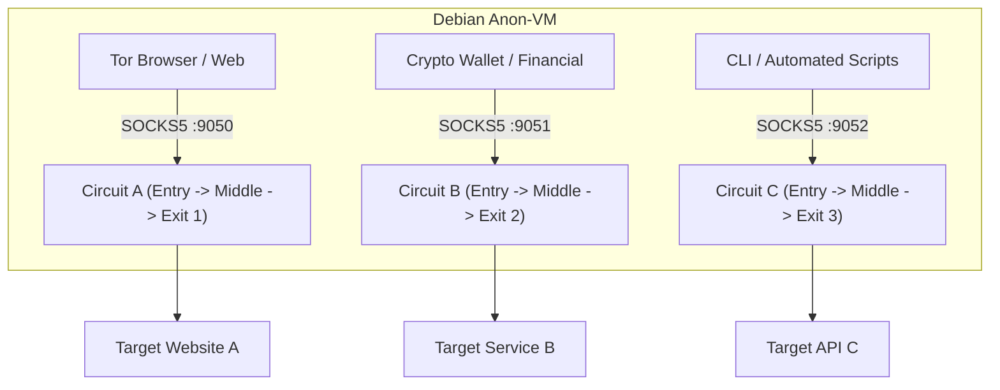

# Software Design Document & System Architecture

## Self-Hosted Anonymous Operating System in a Virtual Machine (Debian Anon-VM)

* **Document:** `docs/ARCHITECTURE.md`
* **Target Operating System:** Debian GNU/Linux 12 (Bookworm) and 13 (Trixie) [ARM64 / x86_64]
* **Target Hypervisors:** UTM (Apple Silicon / macOS), VirtualBox, KVM / QEMU
* **Status:** Stable / Production-Ready

---

## 1. System Overview & Philosophy

The objective of `debian-anon-vm` is to transform a standard minimal installation of Debian GNU/Linux (12 or 13) into an isolated, hardened, fail-closed anonymous virtual workstation. All non-local network traffic (TCP and DNS) is strictly routed through the Tor network, while non-Tor egress (IPv6, raw UDP, ICMP) is destroyed at the kernel level.

### 1.1. Core Architectural Flow

---

## 2. Core Architectural Decisions

### 2.1. Fail-Closed Firewall: Why `nftables` over `iptables`

* **Atomic Ruleset Replacement:** `nftables` updates its ruleset atomically in a single kernel transaction (`nft -f`). Unlike legacy `iptables`, there is no window where partial rules are active during firewall reloads.
* **Unified Family Handling:** A single `table ip` and `table ip6` syntax manages both IPv4 redirection and total IPv6 blockage cleanly.
* **Native Socket Matching:** `skuid debian-tor` matching allows the Tor daemon itself to send packets to the physical network while redirecting or dropping all other user and system processes.

### 2.2. Robust DNS Leak Prevention

* **The Problem:** Modifying `/etc/resolv.conf` with `chattr +i` breaks package manager upgrades (`apt-get upgrade`) and DHCP lease updates.
* **The Solution:** NetworkManager is instructed to relinquish DNS management via `/etc/NetworkManager/conf.d/no-dns.conf` (`dns=none`), `systemd-resolved` is masked, and `/etc/resolv.conf` is pointed to `127.0.0.1`. Inbound UDP port 53 traffic is captured by `nftables` and redirected to Tor's `DNSPort` at `127.0.0.1:5353`.

### 2.3. Stream Isolation Architecture

Rather than pooling all application traffic through a single Tor circuit, `anon-vm` provides multiple isolated SOCKS ports in `/etc/tor/torrc`:

* **Port 9040 (TransPort):** Transparent proxy with `IsolateDestAddr` and `IsolateDestPort`.
* **Port 9050 (SOCKS):** Default proxy with `IsolateDestAddr` and `IsolateDestPort`.
* **Port 9051 (SOCKS):** Dedicated for cryptocurrency wallets or financial apps with `IsolateDestAddr`.
* **Port 9052 (SOCKS):** Maximum isolation with `IsolateDestAddr`, `IsolateDestPort`, and `IsolateClientAddr`.

---

## 3. Kernel and OS Hardening Rationale

### 3.1. Process and Memory Protection (Yama LSM & GRUB)

* **`kernel.yama.ptrace_scope = 2`:** Prevents an unprivileged process from attaching to or injecting code into other processes owned by the same user (such as inspecting browser memory).
* **`dev.tty.legacy_tiocsti = 0`:** Closes a classic sandbox escape vector where child processes inject keystrokes into the controlling TTY.
* **`init_on_alloc=1` & `init_on_free=1` (GRUB):** Fills memory pages with zeros upon allocation and deallocation, mitigating Use-After-Free vulnerabilities and residual memory forensics.
* **`fs.suid_dumpable = 0` & `systemd-coredump` disabled:** Prevents sensitive memory contents (keys, tokens) from being dumped to disk during application crashes.

### 3.2. User Session Hardening

* **`UMASK 027` & `chmod 700 /home/*`:** Files created by users are unreadable by other local accounts or unprivileged services.
* **`TMOUT=900`:** Automatically logs out idle shell sessions after 15 minutes.
* **`sudo use_pty`:** Prevents sudo commands from capturing and manipulating user terminal buffers.

### 3.3. Mount Hardening and Process Isolation

* **`noexec,nosuid,nodev` on `/tmp` and `/dev/shm`:** Prevents attackers from executing payloads directly from temporary world-writable directories.
* **`hidepid=2,gid=sudo` on `/proc`:** Prevents unprivileged users from viewing processes owned by other users (including the Tor daemon and system daemons).

---

## 4. Mandatory Pre-requisite: LUKS Full-Disk Encryption

> [!IMPORTANT]
> Because `debian-anon-vm` is designed as a persistent virtual workstation rather than a RAM-only Live ISO (like Tails), **Full-Disk Encryption (LUKS2)** is mandatory during Debian installation. This ensures that when the VM is powered off, no unencrypted browsing history, private keys, or swap pages remain accessible on the host filesystem.
