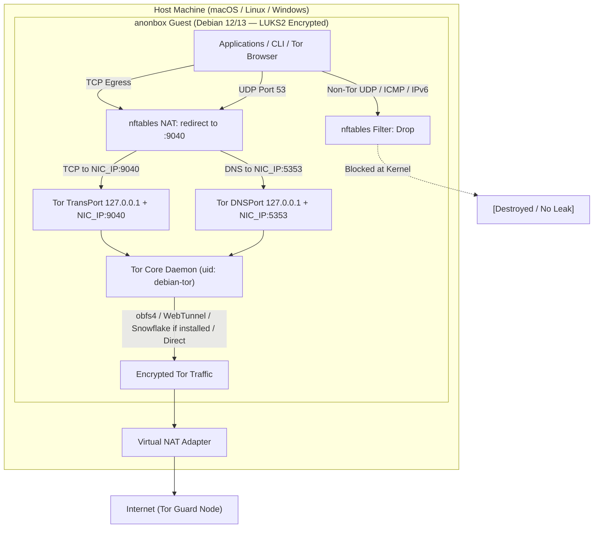
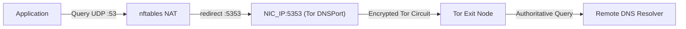
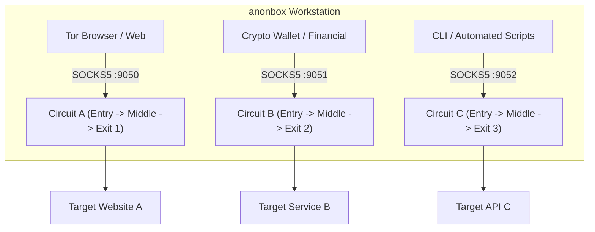

# Software Design Document & System Architecture

## Self-Hosted Fail-Closed Tor Workstation Toolkit (`anonbox`)

* **Document:** `docs/ARCHITECTURE.md`
* **Target Operating System:** Debian GNU/Linux 12 (Bookworm) and 13 (Trixie) [ARM64 / x86_64]
* **Target Hypervisors:** UTM (Apple Silicon / macOS), VirtualBox, KVM / QEMU
* **Status:** Hardening toolkit / v1.2 — dedicated Debian **guest VM** only; nft redirect + NIC TransPort (INPUT-mitigated); AppArmor fail-hard; fail-closed. **Not** Tails amnesia or Whonix dual-VM.

---

## 1. System Overview & Philosophy

The objective of `anonbox` is to transform a standard minimal installation of Debian GNU/Linux (12 or 13) **in a dedicated guest VM** into an isolated, hardened, fail-closed anonymous virtual workstation. All non-local network traffic (TCP and DNS) is strictly routed through the Tor network, while non-Tor egress (IPv6, raw UDP, ICMP) is destroyed at the kernel level. Persistence is intentional; disk encryption is **user-provided** at install time (see §5). Do not run this toolkit on a daily host OS.

### 1.1. Core Architectural Flow

---

## 2. Network & Packet Filter Architecture (`nftables`)

### 2.1. Fail-Closed Firewall: Why `nftables` over `iptables`

* **Atomic Ruleset Replacement:** `nftables` updates its ruleset atomically in a single kernel transaction (`nft -f`). Unlike legacy `iptables`, there is no window where partial rules are active during firewall reloads.
* **Unified Family Handling:** A single `table ip` and `table ip6` syntax manages both IPv4 redirection and total IPv6 blockage cleanly.
* **Native Socket Matching:** `skuid debian-tor` matching allows the Tor daemon itself to send packets to the physical network while redirecting or dropping all other user and system processes.

### 2.2. Robust DNS Leak Prevention & Precedence

* **Redirect (not DNAT to loopback):** In `table ip tor_nat`, DNS is redirected (`udp/tcp dport 53 redirect to :5353`) at the **top** of `chain output` before any `oifname "lo" return`. Remaining TCP uses `redirect to :9040`. nft `redirect` rewrites the destination to the primary IPv4 of the egress interface, so Tor must also listen on that NIC IP for TransPort/DNSPort. Binding `0.0.0.0` is forbidden. **Residual:** NIC binds are reachable if nftables is not loaded; INPUT explicitly `drop`s new connections to TCP 9040/5353 and UDP 5353. OUTPUT uses `fib daddr type local accept` for post-redirect delivery (narrow `$IFACE_IP` port accepts were insufficient on Debian 13).
* **Safe Tor sockets:** SOCKS and ControlPort bind `127.0.0.1` only. Debian insecure defaults (`SocksPort 9050` without bind, WorldWritable unix socks) are replaced by `/etc/tor/anonbox-defaults-torrc` plus a `tor@default` systemd drop-in (`SocksPort 0` cannot be combined with nonzero SocksPort in the same config). TransPort/DNSPort bind `127.0.0.1` and the NIC primary IP. Setup waits until `tor@default` is active and `ss` confirms binds, then bootstraps to 100% or aborts.
* **NetworkManager DNS Management:** NetworkManager is instructed to relinquish DNS management via `/etc/NetworkManager/conf.d/no-dns.conf` (`dns=none`), `systemd-resolved` is masked, and `/etc/resolv.conf` is statically fixed to `127.0.0.1` (without `trust-ad`).

### 2.3. Boot Race Condition Protection

To eliminate the microsecond packet leak window where network interfaces come up before firewall rules load, `anonbox` deploys a systemd drop-in override at `/etc/systemd/system/nftables.service.d/override.conf`:

* `After=systemd-modules-load.service sysinit.target`
* `Before=network-pre.target shutdown.target`
* `Wants=network-pre.target`
* `DefaultDependencies=no`

Setup asserts live `tor_nat` / `tor_filter` tables after load.

### 2.4. LAN Egress Restriction & Administration

* **Zero Outbound RFC 1918 Leak:** New outbound TCP to `10.0.0.0/8`, `172.16.0.0/12`, `192.168.0.0/16` is not redirected and is dropped in the filter output chain.
* **No inbound SSH by default:** Administration is via the hypervisor console. INPUT does not accept RFC1918 SSH or ICMP echo (`--allow-ssh` optional for lab).
* **Restricted conntrack:** OUTPUT does **not** `accept` `ct state established,related` for arbitrary UIDs. OUTPUT allows loopback, NIC TransPort/DNSPort delivery, `skuid` of the Tor daemon, and DHCP. INPUT accepts loopback plus `established,related`, then drops TransPort/DNSPort, then optional SSH. `conntrack -F` runs after loading rules when safe for SSH.
* **DHCP Renewal Exemption:** Outbound DHCP lease renewal queries are explicitly allowed on the virtual adapter.

### 2.5. Stream Isolation Architecture

Rather than pooling all application traffic through a single Tor circuit, `anonbox` provides multiple isolated SOCKS ports in `/etc/tor/torrc`:

* **Port 9040 (TransPort):** Transparent proxy with `IsolateDestAddr` and `IsolateDestPort`.
* **Port 9050 (SOCKS):** Default proxy with `IsolateDestAddr` and `IsolateDestPort`.
* **Port 9051 (SOCKS):** Dedicated for cryptocurrency wallets or financial apps with `IsolateDestAddr`.
* **Port 9052 (SOCKS):** Maximum isolation with `IsolateDestAddr`, `IsolateDestPort`, and `IsolateClientAddr`.

### 2.6. Anti-Censorship Pluggable Transports & Bridge Ingestion

For operation in heavily filtered networks (such as state-level DPI firewalls), `anonbox` supports pluggable transports:

* **Pluggable Transport Binaries:** `obfs4` and `webtunnel` use `/usr/bin/obfs4proxy` or `/usr/bin/lyrebird`. `ClientTransportPlugin snowflake` is emitted only when `/usr/bin/snowflake-client` exists.
* **Bridge Ingestion Pipeline:** When `--bridges-file <file>` is provided, the installer allowlists only lines that start with the `Bridge` keyword (comments/empties ignored; other torrc directives rejected), injects `UseBridges 1`, then runs `tor --verify-config` and `assert_torrc_safe_binds` before start.
* **Start gate (`start_tor_or_die`):** Syntax is checked with `tor --verify-config`, listeners must not use `0.0.0.0`, `tor@default` must become `active`, `ss` must show expected binds, and bootstrap must reach 100% or setup aborts. AppArmor for Tor is applied **before** this start.

---

## 3. Kernel, Memory & System Hardening (KSPP & Tails Standards)

### 3.1. Kernel Self-Protection (KSPP) & Sysctl Stack

* **`kernel.yama.ptrace_scope = 2`:** Prevents an unprivileged process from attaching to or injecting code into other processes owned by the same user (such as inspecting browser memory).
* **`dev.tty.legacy_tiocsti = 0`:** Closes a classic sandbox escape vector where child processes inject keystrokes into the controlling TTY.
* **`kernel.randomize_va_space = 2`:** Enforces full Address Space Layout Randomization (ASLR) for stack, VDSO, heap, and mmap allocations.
* **`kernel.kexec_load_disabled = 1`:** Prevents runtime replacement of the running Linux kernel via kexec.
* **Unprivileged user namespaces remain enabled:** `kernel.unprivileged_userns_clone` is not set to `0` (and 1.0.0 installs are reverted to `1`) so Tor Browser’s content sandbox can function.
* **`net.ipv4.tcp_timestamps = 0`:** Disables TCP timestamps to prevent microsecond clock-skew de-anonymization and machine correlation across circuits.
* **`net.ipv4.conf.all.route_localnet = 1`:** Retained for local delivery edge cases; transparent proxying uses nft `redirect` to the NIC IP.
* **`init_on_alloc=1` & `init_on_free=1` (GRUB):** Fills memory pages with zeros upon allocation and deallocation, mitigating Use-After-Free vulnerabilities and residual memory forensics.
* **`fs.suid_dumpable = 0` & `systemd-coredump` disabled:** Prevents sensitive memory contents (keys, tokens) from being dumped to disk during application crashes.

### 3.2. User Session Hardening

* **`UMASK 027` & `chmod 700 /home/*`:** Files created by users are unreadable by other local accounts or unprivileged services.
* **`TMOUT=900`:** Automatically logs out idle shell sessions after 15 minutes.
* **`sudo use_pty`:** Prevents sudo commands from capturing and manipulating user terminal buffers.
* **`pam_wheel.so use_uid group=sudo`:** Restricts the `su` command to members of the Debian `sudo` group.

### 3.3. Mount Hardening & Attack Surface Reduction

* **`noexec,nosuid,nodev` on `/tmp`, `/var/tmp`, and `/dev/shm`:** Prevents execution of malicious payloads from temporary world-writable directories.
* **`hidepid=2,gid=sudo` on `/proc`:** Hides other users’ PIDs from accounts **not** in `sudo`. The typical anonbox operator is in `sudo` and can still see Tor/system PIDs — defense against extra local guests, not against the owner.
* **Extended Module Blacklist:** Disables vulnerable and legacy subsystems: `bluetooth`, `btusb`, `vivid`, `dccp`, `sctp`, `rds`, `tipc`, `cramfs`, `freevxfs`, `jffs2`, `hfs`, `hfsplus`, `udf`, `firewire-core`, `thunderbolt`, `n-hdlc`, `ax25`, `netrom`, `x25`, `rose`, `decnet`.
* **Mandatory Access Control:** AppArmor is enabled. Setup writes `/etc/apparmor.d/local/system_tor` with `owner /var/lib/tor/**` and `/var/log/tor` only (does not re-declare PT binaries — that conflicts with Debian `system_tor` x modifiers). `apparmor_parser -r` is fail-hard **before** Tor starts. `DataDirectoryGroupReadable` is not used.

---

## 4. Anti-Fingerprinting & Telemetry Suppression

### 4.1. System Identity Camouflage (`machine-id`)

* **Standardized Anonymity Pool:** `/etc/machine-id` and `/var/lib/dbus/machine-id` are fixed to a uniform UUID (`b080b36e271609e5dd34d2b90ef76453`), preventing local applications from generating persistent cross-session tracking tokens.

### 4.2. Network & DHCP Privacy

* **Native NetworkManager MAC Randomization:** `cloned-mac-address=random` in `/etc/NetworkManager/conf.d/00-mac-randomize.conf` ensures MAC address rotation occurs before the first DHCP packet is emitted.
* **Suppression of DHCP Hostname (Option 12):** `ethernet.dhcp-send-hostname=false` stops the VM from revealing its hostname to the local router or hypervisor.
* **Deactivation of Connectivity Checks:** NetworkManager connectivity checking (`http://network-test.debian.org/nm`) is disabled via `[connectivity] enabled=false`.

### 4.3. Telemetry Removal & Anonymous Time Sync

* **Popularity Contest Purged:** `popularity-contest` is uninstalled during setup.
* **Masked Services:** `geoclue.service` (geolocation), `kerneloops.service`, `whoopsie.service`, `avahi-daemon`, and `cups` are masked.
* **Deterministic `htpdate` over Tor:** Time synchronization occurs securely via Tor SOCKS5 using `htpdate`, polling until port 9050 is available.
* **UTC Timezone & Neutral Hostname:** `timedatectl set-timezone UTC` and `hostnamectl set-hostname localhost`.

---

## 5. Storage Encryption (user-provided; required for SAFE)

> [!IMPORTANT]
> `anonbox` is a **persistent** virtual workstation (not a RAM-only Live ISO like Tails). **Disk encryption is your responsibility** at Debian install time — the toolkit does **not** set up LUKS/eCryptfs.
>
> * The script **runs without** encryption (setup does not abort).
> * **Keep data** on the VM → enable LUKS2 (preferred) or eCryptfs (**recommended**).
> * **Throwaway** / discard disk / revert [hypervisor snapshot](HYPERVISORS.md) → encryption optional.
> * `anonbox check` reports **SAFE** only when LUKS or eCryptfs is detected (`FAIL` if missing). Without a passphrase, cleartext disk images on the host remain readable.

## 6. IFACE_IP / TransPort drift

Tor `TransPort`/`DNSPort` bind the NIC primary IPv4 at setup time. If DHCP or hypervisor NAT changes that address, nft `redirect` targets a stale bind. `anonbox check` **FAIL**s when the live primary IPv4 ≠ the TransPort NIC bind in `torrc`/`ss`. `setup`/`harden`/`status` warn to re-run `setup` after IP changes (no NetworkManager dispatcher hook in this release).
